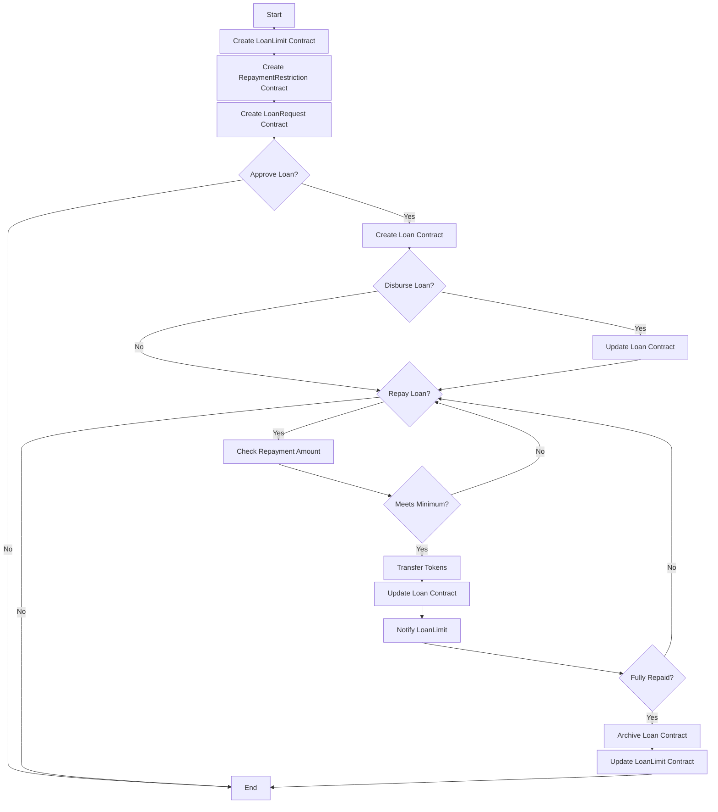
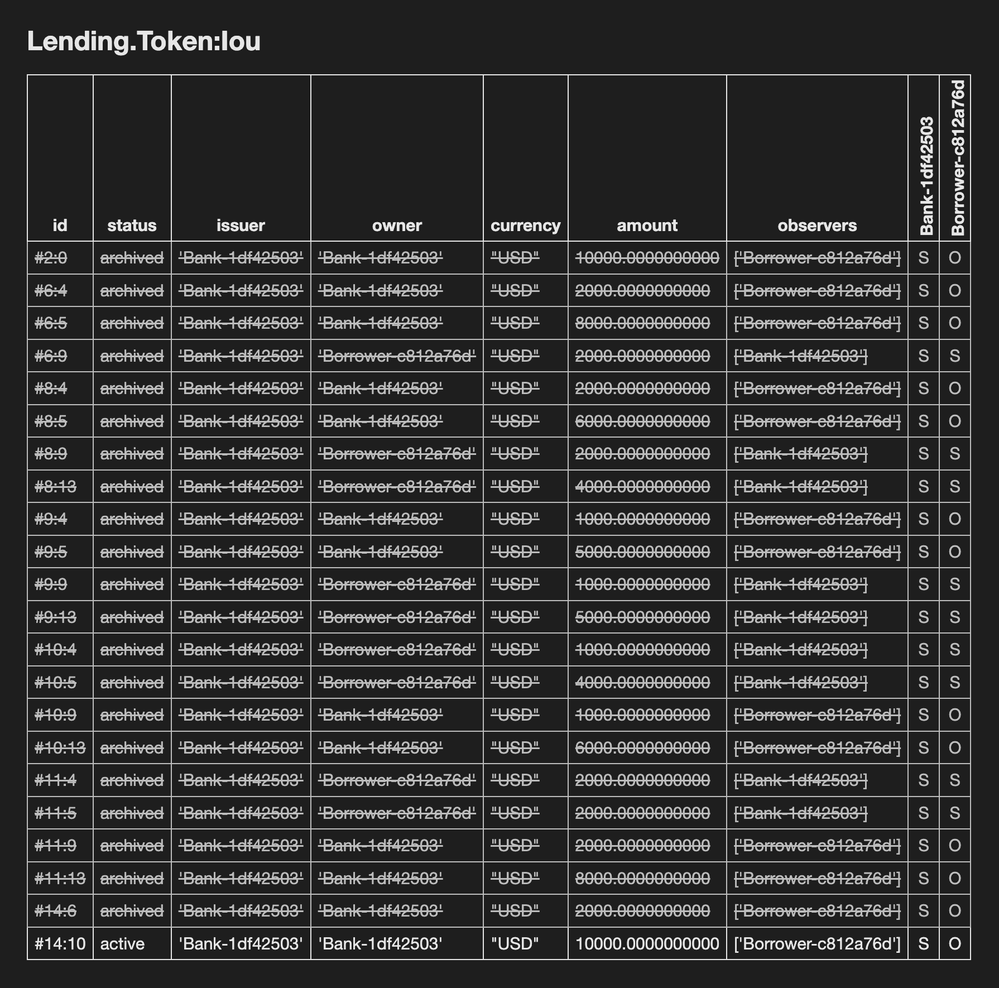
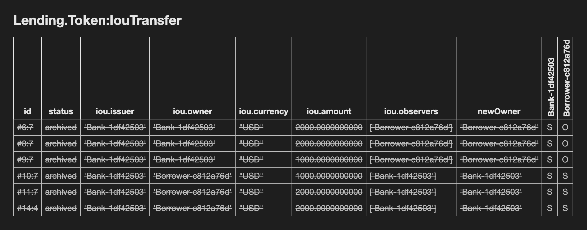

# Loan Repayment Workflow Documentation

## Task Overview

### Goal:
The core of this solution revolves around enforcing structure and compliance in the loan repayment process. By implementing both incremental disbursements and incremental repayments, I created a system that is flexible for borrowers yet ensures banks maintain control over loan distribution and repayment.

The DAML test scripts played a vital role in validating each step of this process, ensuring that the system behaves as expected under various conditions (e.g., valid repayments, invalid zero repayments, excessive repayments, etc.).

Overall, the design emphasizes clarity, control, and compliance, providing a robust framework for secure financial transactions.

### Key requirements included:

    •	Implementing a RepaymentRestriction to define the minimum repayment amount.
    •	Adding a Repay choice to the Loan contract, ensuring that repayments respect the minimum amount.
    •	The contract should update the total repaid amount and archive itself once fully repaid.

## Code Design and Approach

### System Architecture and Entities


#### The main entities involved in this workflow are:

    •	Bank: Approves loans, issues tokens, and manages disbursement.
    •	Borrower: Requests a loan, receives disbursements in stages, and is responsible for repayment.
    •	Central Bank: Enforces rules such as repayment restrictions and oversees loan limits.

#### Key templates:

    •	LoanLimit: Tracks the loan utilization and sets limits for each borrower.
    •	RepaymentRestriction: Defines the minimum repayment allowed for each borrower.
    •	Loan: Governs the loan lifecycle, including disbursement and repayment.
    •	Token: Represents the loan value in tokenized form (e.g., IOUs).

#### Test Scripts

The DAML test scripts created to simulate the entire loan approval, disbursement, and repayment process. These tests are crucial to ensure that all requirements are met.

#### Test Workflow:

    1.	Loan Request: The borrower submits a loan request, and the bank approves it.
    2.	Disbursement: The bank partially disburses the loan, ensuring no disbursement exceeds the approved limit or falls below zero.
    3.	Repayment: The borrower repays the loan in increments, ensuring that each repayment meets the minimum requirement.
    4.	Contract Archival: Once the total repaid amount equals the loan amount, the contract is archived.


### Step 1: Clone the GitHub Repository

To start, clone the [project repository](https://github.com/OnahProsperity/daml_lending_contract.git) from GitHub using the following command:
```sh
git clone <repository_url>
cd <repository_folder>****
```
### Step 2: Set Up the Daml Environment
This project targets **Daml SDK 3.5** and is built with `dpm`, the Digital Asset Package Manager (the replacement for the legacy `daml` assistant). Install `dpm` by following the [official instructions](https://docs.digitalasset.com/build/3.5/dpm/dpm.html), make sure `~/.dpm/bin` is on your `PATH`, then install the SDK version pinned in `daml.yaml`:

```sh
dpm version          # lists available / installed SDKs
dpm install          # installs the sdk-version from daml.yaml (3.5.12)
```

A JDK 11 or newer is required to run the test scripts.

### Step 3: Build the Project
Navigate to the project directory and build the project using the following command:

```sh
dpm build
```

### Step 4: Run the Tests
Execute the tests to ensure everything is working correctly:

```sh
dpm test
```

`dpm test` prints a pass/fail summary. The contract tables shown below come from the compiler's table view. To regenerate them (and the PNGs under `Img/`) run:

```sh
scripts/test-report.sh
```

The script runs each test file separately, writes the HTML table and transaction views to `test-report/` (git-ignored), and screenshots one table per template into `Img/` using headless Chromium. Use `SKIP_PNG=1` to produce only the HTML, or `REPORT_SOURCE=LendingSuccessLoan` to screenshot a different script. The same views are available interactively in Daml Studio (`dpm studio`) via the **Script results** code lens above each script.

## Breakdown & Implementation:

1. **RepaymentRestriction Template:**
   - [x] Implemented a `RepaymentRestriction` template that specifies the minimum amount required for each repayment.
   
2. **Loan Template:**
   - [x] **Repay Choice:**
     - Allows the borrower to make repayments on their loan.
   - [x] **Minimum Repayment Enforcement:**
     - Ensures that the repayment amount meets the minimum repayment requirement from the `RepaymentRestriction` contract.
   - [x] **Updating Total Repaid Amount:**
     - The `Repay` choice updates the total repaid amount after each repayment.
   - [x] **Token Transfer & Archive:**
     - The token contract associated with the repayment is updated.
     - Upon full repayment, the loan contract is archived, and the utilized loan amount is updated in the `LoanLimit` contract.
   
3. **LoanLimit Template:**
   - [x] **Update Utilized Loan Amount:**
     - A choice `UpdateUtilizedAmount` is implemented to update the utilized loan amount whenever there is a repayment or disbursement.
   
4. **Test Scripts:**
   - **Test for Full Disbursement & Repayment:**
     - [x] Tested successful full disbursement and repayment workflow, covering the following steps:
       - [x] Loan request approval.
       - [x] Disbursement of the full loan amount.
       - [x] Repayment of the full loan amount.
       - [x] Archiving the loan contract upon full repayment.
       - [x] Updating the utilized loan amount in the `LoanLimit` contract.
  
   - **Test for Partial Disbursement & Repayment:**
     - [x] Tested partial disbursement and repayment workflow, covering:
       - [x] Partial disbursement of the loan amount in multiple stages.
       - [x] Incremental repayment of the loan in multiple stages.
       - [x] Correct updating of the total repaid amount and remaining amount.
       - [x] Proper handling of minimum repayment restrictions.

## Detailed Breakdown of Test Coverage:

The tables below are the final ledger state of the partial disbursement and repayment script (`daml/Test/LendingPartialDisburseRepay.daml`), one table per template. Struck-through rows are archived contracts; the right-hand columns show each party's relationship to the contract (**S** signatory, **O** observer, **D** divulged).

### 1. Full Disbursement & Repayment Test (`testSuccessfulDisburse`)
   - **Loan Request Validation**: 
     - Verifies the borrower and bank's involvement in the loan request and checks the requested loan amount.
   - **Disbursement Tests**:
     - Ensures that attempts to disburse zero or negative amounts fail.
     - Prevents disbursement beyond the borrower's loan limit.
     - Successfully disburses the full amount when all checks are passed.
   - **Repayment Tests**:
     - Validates full repayment and ensures that the total repaid amount is updated correctly.
     - Verifies that the loan contract is archived upon full repayment and that the `LoanLimit` is updated.

### 2. Partial Disbursement & Repayment Test (`testPartialDisburseRepay`)
   - **Loan Request Validation**: 
     - Same as the full disbursement test.
   - **Partial Disbursement Tests**:
     - Verifies correct handling of partial disbursements in multiple stages.
     - Ensures that the total disbursed amount is updated correctly after each disbursement.
   - **Partial Repayment Tests**:
     - Validates incremental repayments.
     - Ensures that the total repaid amount is updated correctly after each repayment.
     - Checks that the repayment adheres to the minimum repayment restrictions defined in the `RepaymentRestriction` contract.

### Ledger state after `testPartialDisburseRepay`

**LoanRequest** — created by the borrower, archived when the bank exercises `Approve`.


**Loan** — three partial disbursements (2000, 2000, 1000) followed by three repayments (1000, 2000, 2000). The active row shows `amountDisbursed = 5000`, `totalRepaidAmount = 5000`, `remainingAmount = 0`.


**LoanLimit** — signed by the Central Bank; the bank's `UpdateLimit` adds the borrower to `borrowerLimits`.


**RepaymentRestriction** — minimum repayment of 100, fetched on every `Repay`.


**Iou** — the cash holding. A disbursement splits the exact amount off the bank's holding and transfers only that piece; a repayment splits the exact amount off the borrower's holding and merges it back into the bank's. After this run the borrower holds nothing and the bank's 10000 holding is whole again.



**IouTransfer** — the two-step transfer proposals, each archived by `IouTransfer_Accept`.



## Conclusion:

The system supports both full and partial loan disbursements and repayments while enforcing repayment restrictions. The tests confirm that the system behaves as expected, with proper updates to loan amounts, token handling, and loan contract archiving.

